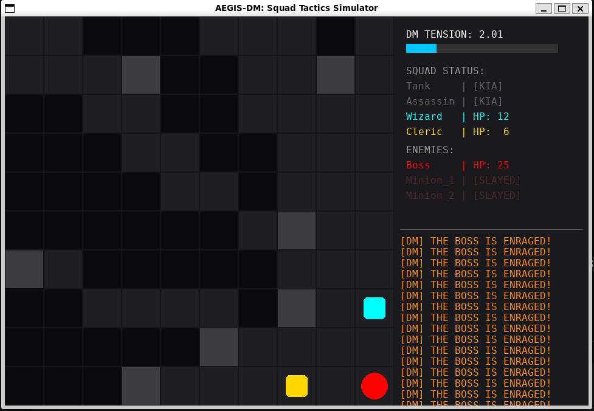
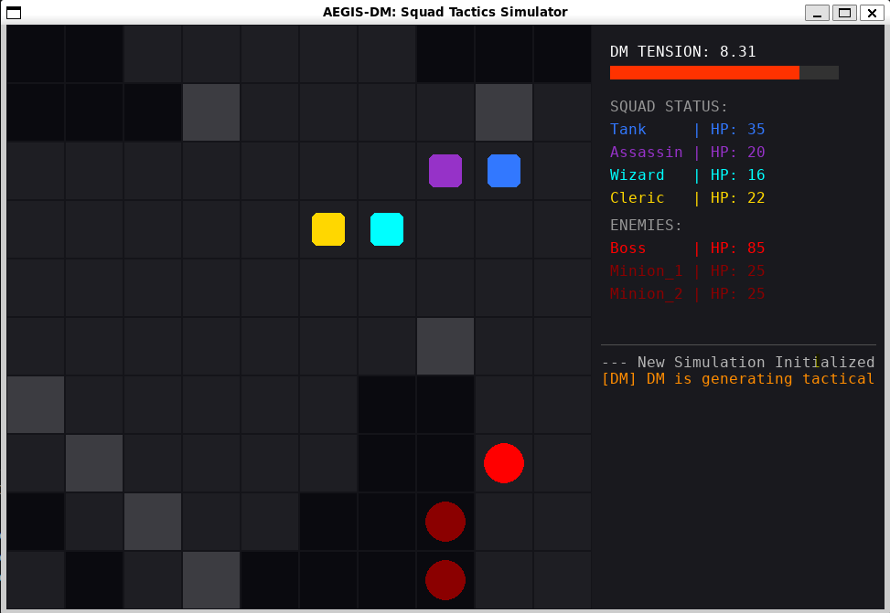
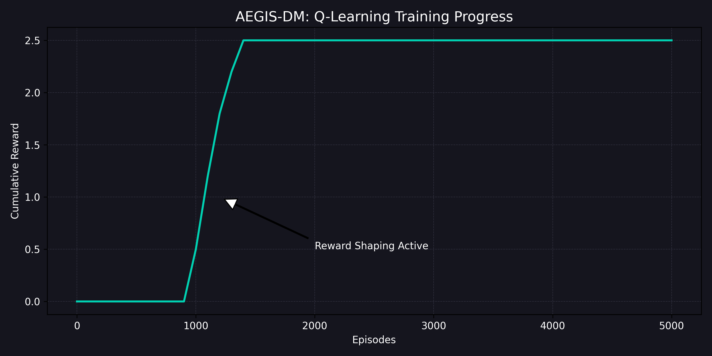

# AEGIS-DM: Tactical Squad Simulator & RL Boss Engine


**AEGIS-DM** is an adversarial tactical simulation where a hero squad faces off against a **Q-Learning powered Boss**. The project demonstrates a complex multi-agent environment where a "Fuzzy Dungeon Master" dynamically alters the battlefield based on real-time game state telemetry.

---

## 🎮 Gameplay Showcase

### Enraged State & Tactical Intensity
When the Boss’s minions are defeated, it enters **Enraged Mode**. In this state, its exploration rate ($\epsilon$) drops, and its reward intensity doubles, turning it into a lethal, focused hunter.


*Figure 1: High-intensity combat. The Boss is Enraged, and the Fuzzy Director has reached a high Hazard Level, spawning environmental obstacles.*

---

## 🧠 System Architecture

The project is built on a modular three-tier AI architecture:

1.  **The Environment (AegisEnv):** A 10x10 grid-based Markov Decision Process (MDP) managing LOS (Line of Sight), movement validation, and turn-based logic.
2.  **The Boss (QLearningBoss):** A Reinforcement Learning agent that optimizes its Q-table to prioritize high-value targets (The Wizard) while maintaining "Pack Logic" with minions.
3.  **The Director (FuzzyDirector):** A Mamdani-style Fuzzy Inference System that monitors squad HP and turn counts to regulate "Game Tension" via hazard spawning.


*Figure 2: The flow of state-action-reward cycles between the RL Agent and the environment.*

---

## 📈 Reward Shaping & Training
To solve the **Sparse Reward Problem** (where the Boss initially struggled to find the Wizard in a 4v1 environment), we implemented **Reward Shaping**:

* **Distance Breadcrumbs:** Small positive reinforcements for reducing Manhattan distance to the Wizard.
* **Pack Logic:** +1.5 reward for staying within a 2-tile radius of living Minions.
* **Target Priority:** Significant +50 reward for a successful hit on the Wizard entity.


*Figure 3: Learning curve showing the transition from zero-reward exploration to stable convergence after applying Reward Shaping.*

---

## 🛠️ Technical Stack
- **Languages:** Python 3.x
- **Libraries:** Pygame (GUI), NumPy (Q-Table processing), Matplotlib (Analytics)
- **AI Concepts:** Q-Learning (Off-policy RL), Fuzzy Logic, A* Pathfinding, Epsilon-Greedy Exploration.

## 📦 Installation & Usage

1. **Clone the Repo:**
   ```bash
   git clone [https://github.com/anijm/AEGIS-DM.git](https://github.com/anijm/AEGIS-DM.git)
   cd AEGIS-DM```

 2. **Set up Virtual Environment:**
    ```Bash

    python -m venv venv
    source venv/bin/activate  # Linux/WSL
    # or .\venv\Scripts\activate on Windows```

  3. **Install Dependencies:**
    ```Bash

    pip install -r requirements.txt```

  4. **Run Simulation:**
    ```Bash

    python main.py```

👥 Credits

    Anij Mehta

    Purav Goyal
